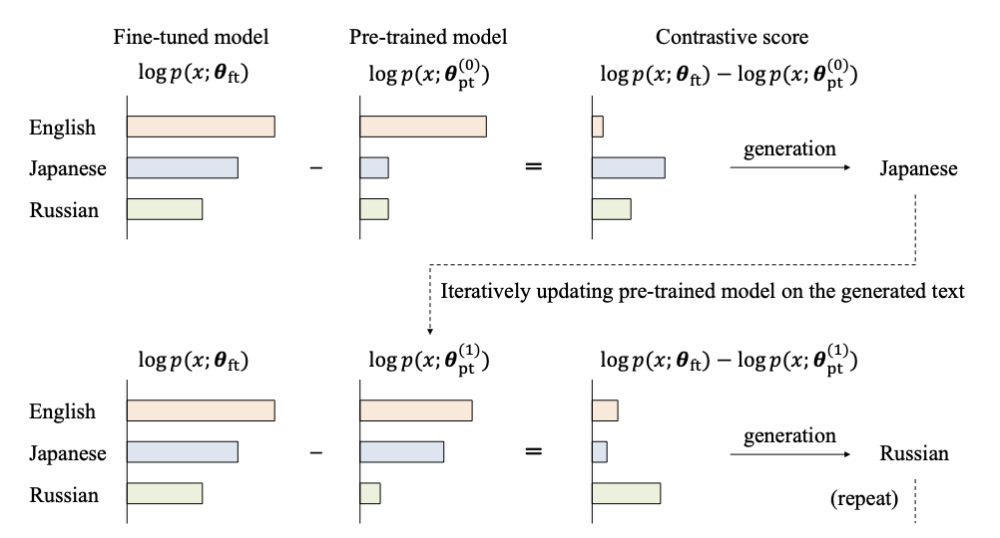

# Code of CGE



### Environment

Python==3.8

- Run the following command to install the required packages:
```
pip install -r requirements.txt
```

- Or you can reproduce the environment if you use conda:
```
conda env create -n cge -f cge.yml
conda activate untrac
```

---

### Discovering the novel domains in the fine-tuning dataset via CGE

Run CGE with the following commands. The generated texts are displayed at each iteration in the console. You can try the static version of CGE by setting --no_update in the arguments of `main.py`.

- Run CGE for Falcon-RW fine-tuned on the code dataset. 

```
bash run_falcon.sh
```

- Run CGE for OpenLlama fine-tuned on the non-English dataset.

```
bash run_llama.sh
```